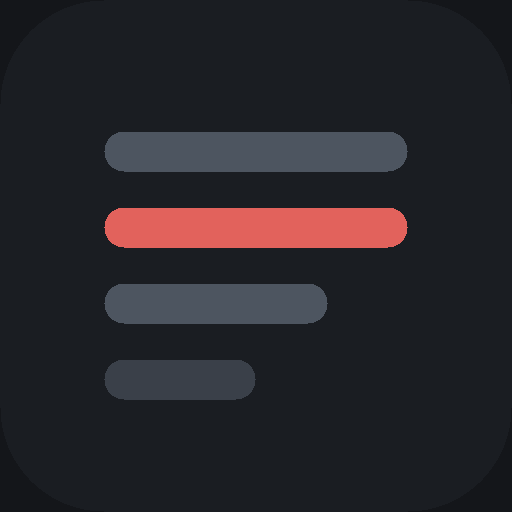
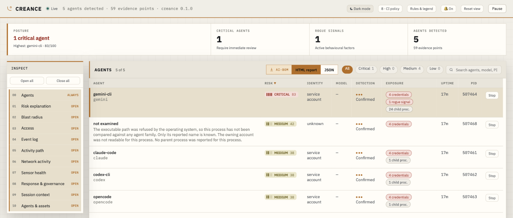
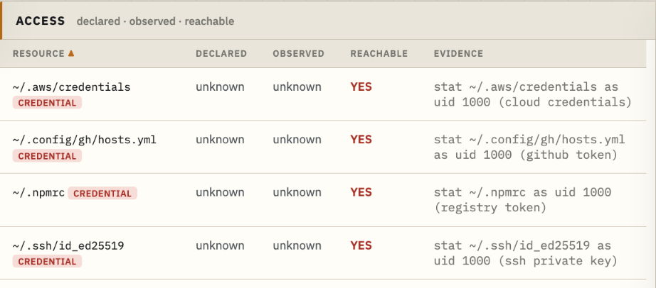
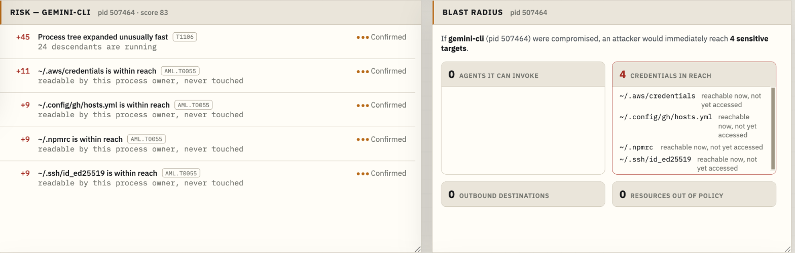

<div align="center">



# Topgent

**`top` for AI agents. See what they can reach, and stop them.**

[](https://github.com/farikonsec/topgent/actions/workflows/ci.yml)
[](https://github.com/farikonsec/topgent/actions/workflows/security.yml)
[](LICENSE)
[](https://www.rust-lang.org)
[](#install)

[Install](#install) · [Features](#features) · [Agents detected](#agents-detected) · [Limits](#limits) · [Roadmap](ROADMAP.md)

</div>

---

Topgent enumerates local AI agent processes, records their accessible resources and observed activity, calculates explainable risk factors, journals state changes, and can terminate a verified process. Processing is local. Detection and scoring use deterministic rules. No model inference is used.

<div align="center">



</div>

## Model

Topgent distinguishes three states:

- declared capability
- observed activity
- currently reachable resources

<div align="center">



</div>

For example, an unread SSH key produces no event. Topgent tests whether the process could open the path. It does not open the file.

## Features

- 🔎 **Executable-based detection.** Detection validates executable provenance. A matching process name alone is insufficient.
- 🔑 **Separate capability states.** Declared, observed, and reachable access are reported independently.
- 📊 **Attributable risk factors.** Each risk point includes factor, evidence, and MITRE ATLAS technique.
- 💥 **Blast-radius graph.** Reports resources and invocable agents reachable after process compromise.
- 🌐 **Network history.** Stores endpoints, listeners, private-network peers, and cloud metadata access for seven days.
- 🧬 **Process-tree analysis.** Reports children, known offensive tooling, and process fan-out.
- 📓 **Append-only journal.** Records grade changes with process identity.
- 🩺 **Sensor coverage.** Reports unsupported, permission-required, and degraded sensors.
- 🛑 **Guarded termination.** Revalidates `(PID, start time)` immediately before signalling.
- 🗺️ **Address ownership.** Every endpoint carries its country and announcing network, from a table compiled into the binary. No lookup at runtime.
- 🔔 **Notifications.** A finding of medium or worse raises one through the platform's own notification centre, with an optional sound.
- 💾 **Session export.** Everything one run found, as a self-contained HTML document and as JSON, with a stated redaction level.
- 📦 **CycloneDX AI-BOM export.** Produces JSON and self-contained HTML reports.
- ⚙️ **CI policy check.** `topgent policy check` reports unavailable detection coverage with a distinct exit code.
- 🔒 **Metadata collection only.** Does not collect prompts, file contents, payloads, or decrypted TLS traffic.

<div align="center">



</div>

## Agents detected

Nineteen agent families are defined. ✓ indicates a verified installation run for that platform. It does not indicate name-only matching.

| Agent | macOS | Linux | Windows | Provenance required |
|---|:---:|:---:|:---:|:---:|
| Claude Code | ✓ | | | |
| Codex CLI | ✓ | | | ✓ |
| Gemini CLI | | ✓ | | ✓ |
| Qwen Code | | ✓ | | ✓ |
| Kimi Code CLI | | ✓ | | ✓ |
| OpenHands | | ✓ | | ✓ |
| Aider | | ✓ | | ✓ |
| Goose | | ✓ | | ✓ |
| OpenCode | | ✓ | | ✓ |
| Amp | | | ✓ | ✓ |
| Ollama | | | ✓ | |
| Cursor | | | | ✓ |
| Windsurf | | | | |
| LM Studio | | | | |
| GitHub Copilot Chat | ✓ | | | |
| ChatGPT for VS Code | ✓ | | | |
| Cline | | ✓ | | |
| Roo Code | | ✓ | | |
| Continue | | ✓ | | |

**Provenance required** means the executable name alone is insufficient. The installation path must also match a known marker for that product.

`codex-cli` requires provenance. A process named `codex` is identified only if its path contains one of:

```
/node_modules/@openai/codex
/chatgpt.app/contents/resources/
/.codex/bin/
```

A binary named `codex` at `~/Downloads/codex` does not match and is not reported as an agent.

`claude-code` does not require provenance. Any process named `claude` matches. Name-only matching can be defeated by renaming a file. Path matching additionally requires the file to be at a location a real installer uses.

An unmarked cell indicates a definition that has not yet completed its verification cycle and currently matches on basename alone. Agent-family definitions are data in [`agent-families.json`](crates/topgent-collect/data/agent-families.json). New definitions require a matching fixture and a non-matching decoy.

Cline, Roo Code, and Continue run in one editor process. Topgent reports that process and its active extensions. It does not attribute activity to an individual extension.

## Install

Pre-built binaries: [Releases](https://github.com/farikonsec/topgent/releases).

| Platform | Command line | Desktop app |
|---|---|---|
| 🍎 **macOS** 12+ (Apple silicon, Intel) | ✓ | `.dmg` |
| 🪟 **Windows** 10/11, Server 2022+ (x64, ARM64) | ✓ | `.zip` |
| 🐧 **Linux** (x86-64) | ✓ | *planned* ([why](ROADMAP.md#next)) |

```sh
tar -xzf topgent-*.tar.gz && ./topgent
```

Build from source. Requires Rust 1.88 or later.

```sh
git clone https://github.com/farikonsec/topgent && cd topgent
cargo build --release && ./target/release/topgent
```

Verify the release archive against `SHA256SUMS` before execution:

```sh
shasum -a 256 -c SHA256SUMS
```

Additional platform support is tracked in the [roadmap](ROADMAP.md).

### Unsigned binaries

Releases are not code-signed. Signing certificates are tracked in the roadmap.

**macOS, desktop application.** Open the `.dmg` and drag `Topgent.app` to Applications. On first launch macOS reports that the developer cannot be verified. Open **System Settings**, then **Privacy & Security**, and select **Open Anyway**. Required once.

**macOS, command line.** Files downloaded by a browser carry a quarantine attribute, and `tar` preserves it on extraction. A quarantined binary run from a terminal produces no output and does not exit. Gatekeeper displays a separate window, which may be behind the terminal or on another desktop. Remove the attribute before the first run:

```sh
xattr -d com.apple.quarantine ./topgent
```

Remove it before the first run. A binary that has already been blocked once stays blocked after the attribute is removed; extract the archive again and remove the attribute before running.

Downloads made with `curl`, `gh`, or `git` are not quarantined and run without this step.

**Windows on ARM.** Use the `aarch64` archive. The x64 build runs under emulation but its process enumeration returns nothing, so every sensor reports available and no agent is found.

**Windows.** SmartScreen displays a warning on first execution. Select **More info**, then **Run anyway**.

## Use

```sh
topgent                # current process inventory
topgent --watch        # continuous collection
topgent doctor         # sensor capability and status
topgent events         # state-change journal
topgent stop <pid>     # guarded process termination
```

Run `topgent doctor` before using collection output. It reports available and unavailable sensors.

CI:

```sh
topgent --json > topgent-report.json
topgent policy check --input topgent-report.json --threshold high --require-coverage
```

Exit status:

| Status | Meaning |
|---:|---|
| `0` | policy passes |
| `1` | policy violations |
| `2` | invalid input |
| `3` | required detection coverage unavailable |

AI-BOM export:

```sh
topgent export cyclonedx --output topgent.cdx.json
topgent export cyclonedx --format html --output topgent-aibom.html
```

## Limits

- Does not read prompts, responses, file contents, or packet payloads.
- Does not decrypt TLS or inspect encrypted application data.
- Does not block pre-execution actions on macOS or Windows.
- Does not distinguish individual agent extensions in a shared editor process.
- Does not report telemetry unavailable from the platform.
- Does not name the destination of a raw ICMP socket. macOS does not expose one to a socket listing, and on Linux it requires `sendto` in the audit rules.
- Does not require root or Administrator execution.

`topgent doctor` reports `unsupported`, `permission_required`, or `degraded` when a sensor cannot provide complete coverage.

Adversaries, assets, and residual risk are documented in [`THREAT-MODEL.md`](THREAT-MODEL.md).

## Architecture

Nine library crates, a command-line tool and a desktop application exchange immutable, attributed `Fact` records.

| Crate | Function |
|---|---|
| `topgent-facts` | Fact vocabulary. No dependencies or I/O. |
| `topgent-collect` | OS collectors. |
| `topgent-core` | Fact-to-agent-graph fold and risk model. |
| `topgent-policy` | Validated policy data, detection signals, and credential locations. |
| `topgent-enforce` | Typed, guarded state-changing operations. |
| `topgent-journal` | Append-only event journal. |
| `topgent-report` | Shared JSON report for CLI, viewer, and application. |
| `topgent-export` | CycloneDX AI-BOM and the session export. |
| `topgent-lab` | Fixtures for verifying detection on a disposable host. |

The core is a pure function of its input. Equivalent facts produce equivalent graphs. Risk policy is stored in [`topgent-policy/data/`](crates/topgent-policy/data/). Finding vocabulary remains a Rust enum; policy data cannot introduce a finding type.

## Verification

CI runs on macOS, Linux, and Windows. It builds current stable Rust and the documented Rust 1.88 minimum. [`scripts/scan.sh`](scripts/scan.sh) runs trufflehog, gitleaks, osv-scanner, and semgrep on each push and every Monday.

Eleven fuzz targets cover every parser that reads something Topgent did not write: the socket listings on three platforms, the audit log, the address decoder, agent configuration, the policy file, and the session export. Five minutes each on a push and an hour weekly.

CI validates builds and tests. Sensor verification requires a live run against a real agent on a disposable host. Such runs record evidence and limits.

Tests are synthetic. They do not open credentials or write persistence locations.

## Contributing

Agent detection additions require an executable fixture and a decoy that must not match. Collector hooks require the full adapter suite and a live run.

See [`CONTRIBUTING.md`](CONTRIBUTING.md).

## Security

Report vulnerabilities through the **Security** tab or to **farhad@hadosec.com**. See [`SECURITY.md`](SECURITY.md).

## Licence

Apache-2.0. Copyright 2026 Hadosec. See [`LICENSE`](LICENSE) and [`NOTICE`](NOTICE).

---

<div align="center">
<sub>

`ai security` · `agent monitoring` · `llm security` · `claude code` · `codex` ·
`cursor` · `mcp` · `edr` · `blast radius` · `cyclonedx` · `ai-bom` · `rust` ·
`local-first` · `devsecops`

</sub></div>
