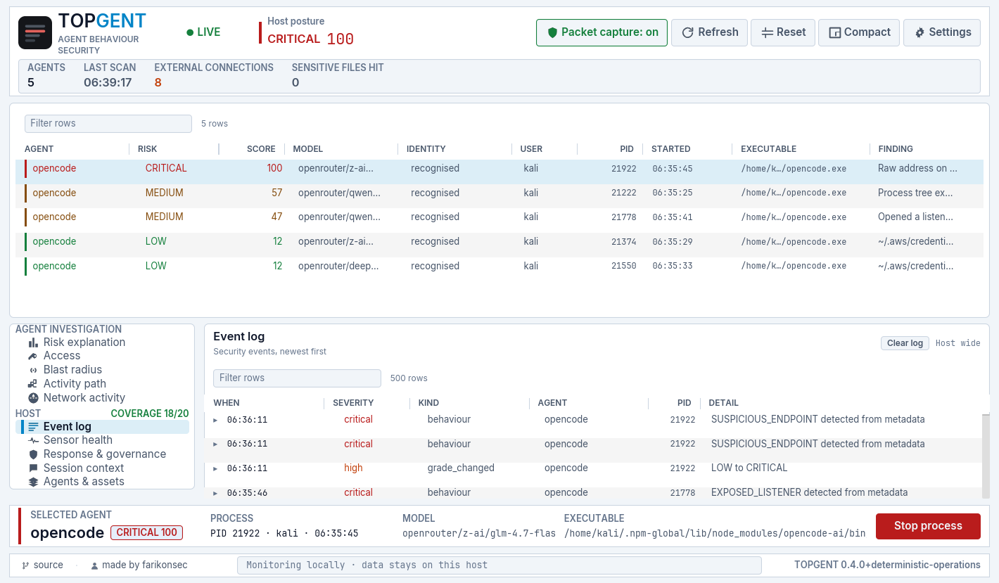
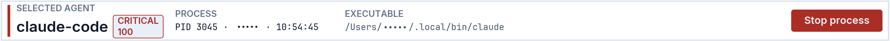
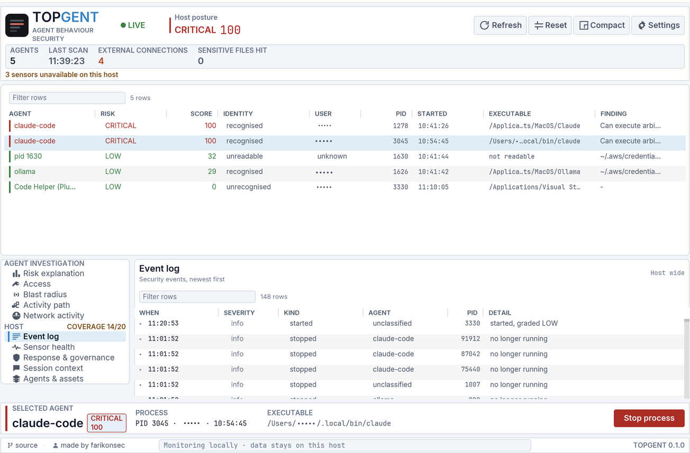
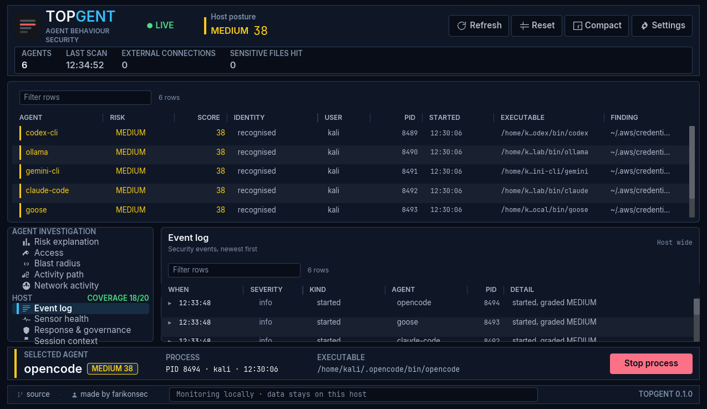

<div align="center">


# Topgent

**`top` for AI agents. See what they can reach, and stop them.**

[](https://github.com/farikonsec/topgent/actions/workflows/ci.yml)
[](https://github.com/farikonsec/topgent/actions/workflows/security.yml)
[](https://github.com/farikonsec/topgent/actions/workflows/fuzz.yml)
[](LICENSE)
[](https://www.rust-lang.org)
[](#install)

[Install](#install) · [Features](#features) · [Agents detected](#agents-detected) · [Limits](#limits) · [Roadmap](ROADMAP.md)

</div>

---

Topgent enumerates local AI agent processes, records their accessible resources and observed activity, calculates explainable risk factors, journals state changes, and can terminate a process after re-checking its identity at the moment of the kill. Processing is local. Detection and scoring use deterministic rules. No LLM is used.

<div align="center">


</div>

## Model

Topgent distinguishes three states:

- declared capability
- observed activity
- currently reachable resources

<div align="center">


</div>

For example, if an SSH key has not been accessed, there will be no event for it. Topgent does not open the key to test access. It asks the operating system whether the account is allowed to read that path.

Reachability is an answer about the **account**. A confined process under the same owner may be unable to read a path reported readable, so every reachable resource carries its evidence: `account_readable` where the kernel answered, `path_resolves` where only the path could be established.

## Features

- 🔎 **Executable-based detection.** Detection validates executable provenance. A matching process name alone is insufficient.
- 🔑 **Separate capability states.** Declared, observed, and reachable access are reported independently, each with the evidence behind it.
- 📊 **Attributable risk factors.** Each risk point carries its factor, evidence, and MITRE ATLAS technique, and the blast radius reachable after compromise.
- 🌐 **Network and process history.** Endpoints, listeners, private-network peers and cloud metadata access for seven days; children, offensive tooling and process fan-out; grade changes journalled against process identity.
- 🩺 **Sensor coverage.** Reports unsupported, permission-required, and degraded sensors, and whether each sensor binary is system-owned or replaceable by the account being watched.
- 📋 **Policy health.** Reports whether the rules in force are the configured ones or built-in defaults, with a digest of the file that was loaded.
- 🛑 **Guarded termination.** Revalidates `(PID, start time)` immediately before signalling.
- 🗺️ **Address ownership.** Every endpoint carries its country and announcing network, from a table compiled in. No lookup at runtime.
- 🔔 **Notifications.** A finding of medium or worse raises one through the platform's own notification centre.
- 💾 **Exports.** The whole session, and a CycloneDX AI-BOM, each as JSON and as a self-contained HTML document with a stated redaction level.
- ⚙️ **CI policy check.** `topgent policy check` validates the whole rule catalogue is accounted for and reports unavailable detection coverage with a distinct exit code.
- 🧾 **Every statement traces to its evidence.** `topgent evidence explain <claim-id>` walks a finding down to the records it was derived from, naming the rule and version that drew it and every record for and against.
- ✍️ **Tamper-evident bundles, verified by something else.** Records are content-addressed and chained; checkpoints are Ed25519-signed. `topgent-verify` checks a bundle offline against a key you already hold and depends on nothing that produced it. Twenty-one modelled attacks each fail with a named reason.
- 🎚️ **Quality and coverage on every claim.** How well an observation was tied to its subject, and what the collector could not have seen, are separate values. `exact` beside `snapshot_only` is common and does not mean complete.
- 🚫 **A band for what was never evaluated.** An agent Topgent could not examine is graded `NOT EVALUATED` with the reason, not scored zero and coloured green.
- 🧠 **Which model an agent is using.** Read from the agent's own session files, configuration and command line, driven by a signature catalogue rather than code. Twelve providers and eight agent families, and adding one is a JSON entry.
- 📡 **Packet capture, on all three platforms.** Optional and off until granted. It shows what a socket listing cannot: UDP peers, ICMP, connections that open and close between two sweeps, and traffic volume per endpoint. Headers only.
- 🔐 **One small binary holds the privilege.** `topgent-capture` reads frames and prints them; the interface reads its output and holds no capability at all. The same separation Wireshark uses for `dumpcap`.
- 🛰️ **Port scans, reported honestly.** Twenty distinct ports on one host in an interval is a scan. Its connections are refused, so no socket exists to attribute them through, and the finding says so rather than guessing at a process.
- 🧹 **A fresh event log on request.** The old one is renamed and kept. A security log is not deleted because somebody wanted a clear view.
- 🔒 **Metadata collection only.** Does not collect prompts, file contents, payloads, or decrypted TLS traffic.

<div align="center">






</div>

## Agents detected

Nineteen agent families are defined. ✓ indicates a verified installation run for that platform. It does not indicate name-only matching.

| Agent | macOS | Linux | Windows | Provenance required |
|---|:---:|:---:|:---:|:---:|
| Claude Code | ✓ | ✓ | ✓ | |
| Codex CLI | ✓ | | | ✓ |
| Gemini CLI | | ✓ | | ✓ |
| Qwen Code | | ✓ | ✓ | ✓ |
| Kimi Code CLI | | ✓ | | ✓ |
| OpenHands | | ✓ | | ✓ |
| Aider | | ✓ | | ✓ |
| Goose | | ✓ | | ✓ |
| OpenCode | ✓ | ✓ | ✓ | ✓ |
| Amp | | | ✓ | ✓ |
| Ollama | ✓ | | ✓ | |
| Cursor | | | | ✓ |
| Windsurf | | | | |
| LM Studio | | | | |
| GitHub Copilot Chat | ✓ | | | |
| ChatGPT for VS Code | ✓ | | | |
| Cline | | ✓ | | |
| Roo Code | | ✓ | | |
| Continue | | ✓ | | |

**Provenance required** means the name alone is insufficient: the path must also match a marker a real installer uses. A binary named `codex` in `~/Downloads` is not reported as an agent. Where provenance is not required, renaming a file is enough to match, which is why the column exists.

Symlinks are followed before matching. Package managers install a link in `bin/` pointing at the real file, and on macOS the link is what the process reports, so every agent installed that way used to be invisible.

Definitions are data in [`agent-families.json`](crates/topgent-collect/data/agent-families.json). A new one needs a matching fixture and a non-matching decoy. An unmarked cell has not completed its verification run and matches on basename alone.

Cline, Roo Code, and Continue run in one editor process. Topgent reports that process and its active extensions. It does not attribute activity to an individual extension.

## Models detected

Which model an agent is using is read from what the agent already writes down:
its session files, its configuration, and its command line. The rules are a
signature catalogue, not code, so a new agent or a new provider is a JSON entry
rather than a release.

| Provider | Matched on |
|---|---|
| Anthropic | `claude…` |
| OpenAI | `gpt…`, `o1…`, `o3…` |
| Google | `gemini…` |
| Meta | `llama…` |
| Alibaba | `qwen…` |
| DeepSeek | `deepseek…` |
| Mistral | `mistral…` |
| xAI | `grok…` |
| Zhipu | `glm…` |
| Moonshot | `kimi…` |

Sources are tried in order per family: Claude Code from its session log, then
its settings, then its command line; OpenCode from its command line first;
Codex CLI from its configuration. A model named on the command line is recorded
as observed; one read from a configuration file is recorded as declared, because
a file says what was asked for and not what was used.

Nothing is inferred from a process name. An agent whose model cannot be
established shows no model rather than a guess.

## Packet capture

Off until granted, and granted separately on each platform. Nothing is captured
before the grant and nothing but headers after it: the read buffer holds the
front of each frame and the kernel discards the rest, so no payload reaches the
process at all.

| Platform | What it needs | How |
|---|---|---|
| Linux | `CAP_NET_RAW` on the helper | `sudo setcap cap_net_raw,cap_net_admin+eip ./topgent-capture` |
| macOS | Read access to `/dev/bpf*` | The `ChmodBPF` helper shipped with Wireshark |
| Windows | The Npcap driver | Npcap's own signed installer |

Topgent installs no driver and changes no permission on anybody's behalf. The
interface shows the exact step and the command that undoes it.

Only `topgent-capture` holds the capability. It reads frames, prints them, and
exits when whatever started it goes away. On Linux the grant goes on that binary
and not on the interface, which is the arrangement Wireshark uses for `dumpcap`
and for the same reason: the large, frequently changed program is exactly the
one that should not hold a raw socket.

Attribution is a join, not a read. A packet carries no process id on any
operating system, so the local port comes off the packet and the socket table
says who holds it. The map is rebuilt inside the capture loop rather than at the
sweep, so a socket that lived forty milliseconds is still there to be found.
Below that, the frame is counted and reported as unattributed rather than
pinned on whichever process took the port next.

## Install

Every link below downloads from the [latest release](https://github.com/farikonsec/topgent/releases/latest) and stays correct as new ones ship. Pick the one matching your processor.

| Platform | Command line | Desktop app |
|---|---|---|
| 🍎 **macOS** 12+ | [Apple silicon][cli-mac-arm] · [Intel][cli-mac-x64] | [Apple silicon][dmg-arm] · [Intel][dmg-x64] |
| 🪟 **Windows** 10/11, Server 2022+ | [ARM64][cli-win-arm] · [x64][cli-win-x64] | [ARM64][app-win-arm] · [x64][app-win-x64] |
| 🐧 **Linux** | [x86-64][cli-lin-x64] | [ARM64][app-lin-arm] · [x86-64][app-lin-x64] |

Also on every release: [`SHA256SUMS`][sums] and [`topgent-sbom.cdx.json`][sbom], the bill of materials for the build itself — a different document from the AI-BOM this tool produces about a host.

[cli-mac-arm]: https://github.com/farikonsec/topgent/releases/latest/download/topgent-aarch64-apple-darwin.tar.gz
[cli-mac-x64]: https://github.com/farikonsec/topgent/releases/latest/download/topgent-x86_64-apple-darwin.tar.gz
[cli-win-arm]: https://github.com/farikonsec/topgent/releases/latest/download/topgent-aarch64-pc-windows-msvc.zip
[cli-win-x64]: https://github.com/farikonsec/topgent/releases/latest/download/topgent-x86_64-pc-windows-msvc.zip
[cli-lin-x64]: https://github.com/farikonsec/topgent/releases/latest/download/topgent-x86_64-unknown-linux-gnu.tar.gz
[dmg-arm]: https://github.com/farikonsec/topgent/releases/latest/download/Topgent-macos-aarch64.dmg
[dmg-x64]: https://github.com/farikonsec/topgent/releases/latest/download/Topgent-macos-x86_64.dmg
[app-win-arm]: https://github.com/farikonsec/topgent/releases/latest/download/Topgent-windows-aarch64.zip
[app-win-x64]: https://github.com/farikonsec/topgent/releases/latest/download/Topgent-windows-x86_64.zip
[app-lin-arm]: https://github.com/farikonsec/topgent/releases/latest/download/Topgent-linux-aarch64.tar.gz
[app-lin-x64]: https://github.com/farikonsec/topgent/releases/latest/download/Topgent-linux-x86_64.tar.gz
[sums]: https://github.com/farikonsec/topgent/releases/latest/download/SHA256SUMS
[sbom]: https://github.com/farikonsec/topgent/releases/latest/download/topgent-sbom.cdx.json

The same build, on two of them. The interface follows the host's own light or dark setting.

<table>
<tr>
<td width="50%"></td>
<td width="50%"></td>
</tr>
<tr>
<td align="center"><sub>macOS 26.6, Apple silicon</sub></td>
<td align="center"><sub>Linux ARM64, Kali 2026.1</sub></td>
</tr>
</table>

```sh
tar -xzf topgent-*.tar.gz && ./topgent
```

Build from source. Requires Rust 1.95 or later.

```sh
git clone https://github.com/farikonsec/topgent && cd topgent
cargo build --release && ./target/release/topgent
```

**Building on Windows** additionally needs the [Npcap SDK](https://npcap.com/#download),
which is headers and import libraries for the capture backend. Unzip it and
point the linker at it before building. It is not the driver, and it is only
needed to build:

```powershell
$env:LIB = "$HOME\npcap-sdk\Lib\ARM64;" + $env:LIB   # or Lib\x64
cargo build --release
```

Verify the release archive against `SHA256SUMS` before execution:

```sh
shasum -a 256 -c SHA256SUMS
```

Additional platform support is tracked in the [roadmap](ROADMAP.md).

### Unsigned binaries

Releases are not code-signed. Signing certificates are tracked in the roadmap.

**macOS, desktop application.** Open the `.dmg` and drag `Topgent.app` to Applications. On first launch macOS reports that the developer cannot be verified. Open **System Settings**, then **Privacy & Security**, and select **Open Anyway**. Required once.

**macOS, command line.** Files downloaded by a browser carry a quarantine attribute, and `tar` preserves it on extraction. A quarantined binary run from a terminal produces no output and does not exit. Gatekeeper displays a separate window, which may be behind the terminal or on another desktop. Remove the attribute before the first run:

```sh
xattr -d com.apple.quarantine ./topgent
```

A binary already blocked once stays blocked after the attribute is removed; extract the archive again first. Downloads made with `curl`, `gh` or `git` are not quarantined.

**Windows on ARM.** Use the `aarch64` archive. The x64 build runs under emulation but its process enumeration returns nothing, so every sensor reports available and no agent is found.

**Windows.** SmartScreen displays a warning on first execution. Select **More info**, then **Run anyway**.

**Linux, desktop application.** Extract the archive and run `./Topgent`. It needs a graphical session; `topgent` is the command-line tool for a headless host. It loads `libxkbcommon` and `libwayland-client` at run time, both present on a normal desktop install. With no Vulkan or GL driver, rendering falls back to software and redraws more slowly. `install-desktop-entry.sh` in the archive adds it to the application menu with its icon, under `~/.local` only.

## Use

```sh
topgent                # current process inventory
topgent --watch        # continuous collection
topgent doctor         # sensor capability and status
topgent events         # state-change journal
topgent stop <pid>     # guarded process termination
```

Run `topgent doctor` before using collection output. It reports available and unavailable sensors.

CI:

```sh
topgent --json > topgent-report.json
topgent policy check --input topgent-report.json --threshold high --require-coverage
```

Exit status:

| Status | Meaning |
|---:|---|
| `0` | policy passes |
| `1` | policy violations |
| `2` | invalid input |
| `3` | required detection coverage unavailable |

AI-BOM export:

```sh
topgent export cyclonedx --output topgent.cdx.json
topgent export cyclonedx --format html --output topgent-aibom.html
```

## Limits

- Does not read prompts, responses, file contents or packet payloads, and does not decrypt TLS. With capture on, the buffer holds headers only and the kernel discards the rest of each frame.
- Does not name the process behind a port scan. Its connections are refused, so no socket exists for any snapshot to attribute them through, at any refresh rate. The traffic is reported against the host probed, marked unattributed, with the reason.
- Does not show packet counts in a single command-line run. Capture starts with the sweep that asks for it, so the first sweep has nothing to report by construction. Use the window, or `topgent --watch`.
- Does not keep the Linux capability across an upgrade. File capabilities live on the file, so a new binary is a new grant.
- Does not block pre-execution actions on macOS or Windows.
- Does not distinguish individual agent extensions in a shared editor process.
- Does not name the destination of a raw ICMP socket. macOS exposes none to a socket listing; Linux needs `sendto` in the audit rules.
- Does not evaluate process confinement. Reachability is an account-level answer; namespaces, containers, chroots and macOS sandbox profiles are not applied.
- Does not verify sensor binaries by signature. Ownership and writability only.
- Does not see a process that lives and dies between two sweeps. Measured on all three platforms: every resident process found, **none of the short-lived ones**.
- Does not evaluate an agent owned by another account. It is graded `NOT EVALUATED` with the reason attached, not scored zero and coloured green.
- Does not establish readability on Windows: there is no `AccessCheck` in this build, so every answer there is `path_resolves` and **no reachability finding can be raised**. A Windows score is therefore lower than a Linux one for the same agent because the evidence cannot be gathered, not because the machine is safer.
- Does not attribute a file read performed by an agent's short-lived child. The kernel names the child, and it is gone before the sweep resolves it.
- Does not account for dropped events. The kernel keeps that counter and reading it needs privilege Topgent does not take, so completeness is never claimed.
- Does not require root or Administrator execution.

`topgent doctor` reports `unsupported`, `permission_required`, or `degraded` when a sensor cannot provide complete coverage.

Adversaries, assets, and residual risk are documented in [`THREAT-MODEL.md`](THREAT-MODEL.md).

What privilege would change, costed against measurements rather than argument, is in `docs/PRIVILEGED-SENSOR-PLAN.md`.

What each word in a finding is allowed to mean — running, owner, started, reachable, visible connection, evidence, complete — is fixed in `docs/NORMATIVE-CLAIMS.md`, along with the attribution quality and collection coverage that every statement carries. A build check refuses prose in this file that claims more than those definitions support. <!-- overclaim-ok: this line names the reserved words rather than using them -->

## Architecture

Eleven library crates, a command-line tool, an offline verifier and a desktop application exchange immutable, attributed `Fact` records.

| Crate | Function |
|---|---|
| `topgent-facts` | Fact vocabulary. No dependencies or I/O. |
| `topgent-collect` | OS collectors. |
| `topgent-core` | Fact-to-agent-graph fold and risk model. |
| `topgent-policy` | Validated policy data, detection signals, and credential locations. |
| `topgent-enforce` | Typed, guarded state-changing operations. |
| `topgent-journal` | Append-only event journal. |
| `topgent-report` | Shared JSON report for CLI, viewer, and application. |
| `topgent-export` | CycloneDX AI-BOM and the session export. |
| `topgent-lab` | Fixtures for verifying detection on a disposable host, the benchmark scorer, and the overclaim lint. |
| `topgent-evidence` | Canonical encoding, content-addressed evidence records, derived claims, the hash chain and signed checkpoints. |
| `topgent-verify` | Offline bundle verifier. Depends on nothing that produced the bundle. |

The core is a pure function of its input. Equivalent facts produce equivalent graphs. Risk policy is stored in [`topgent-policy/data/`](crates/topgent-policy/data/). Finding vocabulary remains a Rust enum; policy data cannot introduce a finding type.

## Verification

CI runs on macOS, Linux, and Windows. It builds current stable Rust and the documented Rust 1.95 minimum. [`scripts/scan.sh`](scripts/scan.sh) runs trufflehog, gitleaks, osv-scanner, and semgrep on each push and every Monday.

Eleven fuzz targets cover every parser that reads something Topgent did not write: the socket listings on three platforms, the audit log, the address decoder, agent configuration, the policy file, and the session export. Five minutes each on a push and an hour weekly.

CI validates builds and tests. Sensor verification requires a live run against a real agent on a disposable host. Such runs record evidence and limits.

Tests are synthetic. They do not open credentials or write persistence locations.

## Contributing

Agent detection additions require an executable fixture and a decoy that must not match. Collector hooks require the full adapter suite and a live run.

See [`CONTRIBUTING.md`](CONTRIBUTING.md).

## Security

Report vulnerabilities through the **Security** tab, using **Report a vulnerability**. Reports are visible only to maintainers. See [`SECURITY.md`](SECURITY.md).

For anything that is not a vulnerability, open an [issue](https://github.com/farikonsec/topgent/issues).

## Licence

Apache-2.0. Copyright 2026 Hadosec. See [`LICENSE`](LICENSE) and [`NOTICE`](NOTICE).

---

<div align="center">
<sub>

`ai security` · `agent monitoring` · `llm security` · `claude code` · `codex` ·
`cursor` · `mcp` · `edr` · `blast radius` · `cyclonedx` · `ai-bom` · `rust` ·
`local-first` · `devsecops`

</sub></div>
